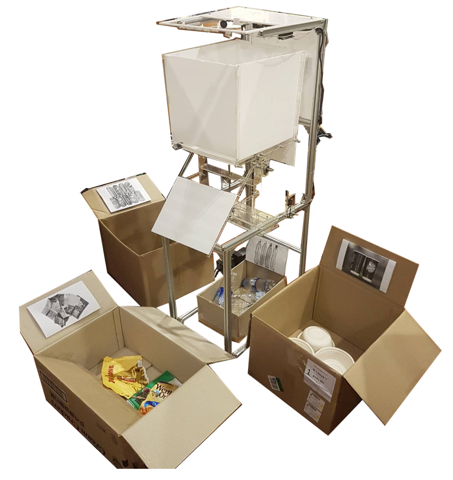
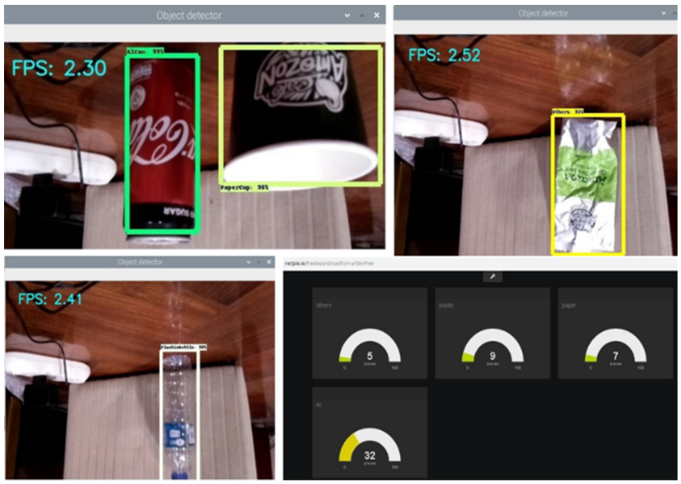
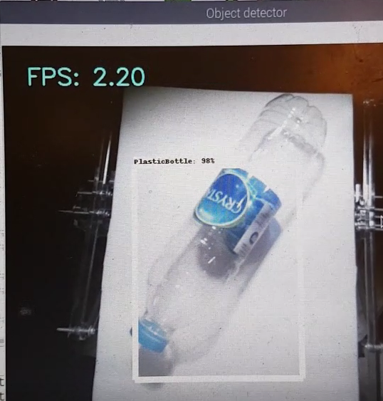
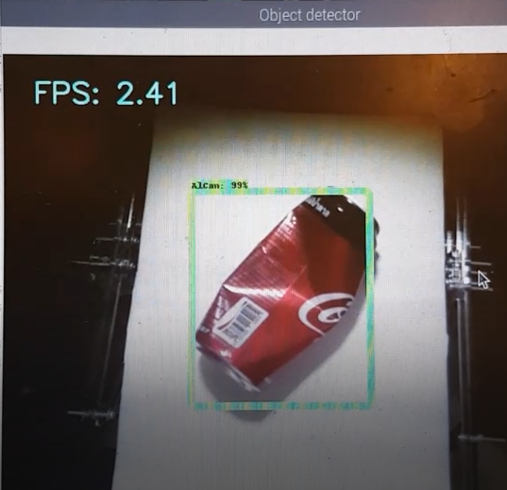
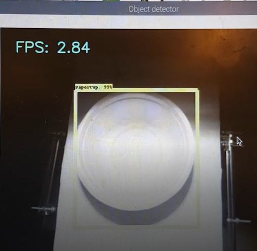
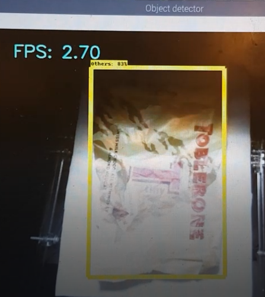

# Garbage-Sorting-Robot-Using-Object-Detection
2103499 Mechanical Engineering Project, Chulalongkorn University  2019-2020

***Advisor:*** Associate Professor Gridsada Phanomchoeng

***Objective:*** Improve the waste management in Thailand by creating a user-friendly robot that can automatically classify various types of garbage with high accuracy and work fast.

### A short demo VDO: [Click here](https://www.youtube.com/watch?v=DpFVvP5Zfqo).

## Data collection
### 1. Types of garbage

### 2. Users' preferences

### All details: [Data collection](https://github.com/saeth40/Garbage-Sorting-Robot-Using-Object-Detection/tree/main/Survey%20data)

## Design the robot

### All details:
1. [related research papers](https://github.com/saeth40/Garbage-Sorting-Robot-Using-Object-Detection/tree/main/Related%20research%20papers)
2. [CAD design](https://github.com/saeth40/Garbage-Sorting-Robot-Using-Object-Detection/tree/main/CAD)
3. [List of equipment](https://github.com/saeth40/Garbage-Sorting-Robot-Using-Object-Detection/tree/main/Equipment)

## Programing and testing
### Training and testing object detection with Netpie IoT server to track system's behaviour

### Deploying model in the robot

### All details
1. [Flowchart and wiring diagram](https://github.com/saeth40/Garbage-Sorting-Robot-Using-Object-Detection/tree/main/Flowchart%20and%20wiring%20diagram)
2. [C++ in Arduino to control sensors and actuators](https://github.com/saeth40/Garbage-Sorting-Robot-Using-Object-Detection/tree/main/C%20%2B%2B)
3. [Python to train and deploy object detection with IoT server]()
4. [Models used in this project](https://github.com/saeth40/Garbage-Sorting-Robot-Using-Object-Detection/tree/main/Python)
5. [Test results](https://github.com/saeth40/Garbage-Sorting-Robot-Using-Object-Detection/tree/main/Result)
