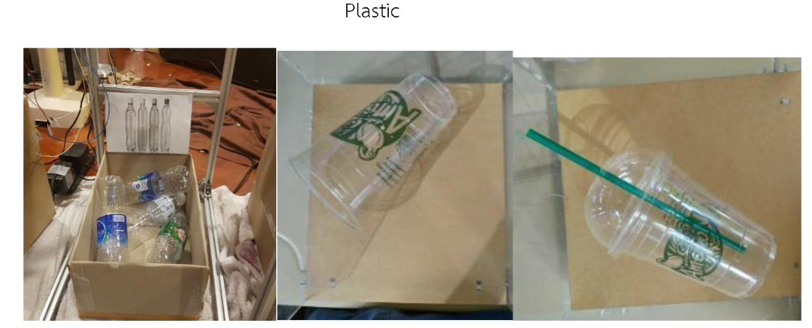

# Garbage-Sorting-Robot-Using-Object-Detection
2103499 Mechanical Engineering Project, Chulalongkorn University  2019-2020

Advisor: Associate Professor Gridsada Phanomchoeng

A short demo VDO: [Click here](https://www.youtube.com/watch?v=DpFVvP5Zfqo).

## Data collection
### 1. Types of garbage

### 2. Users' preferences

All details: [Data collection](https://github.com/saeth40/Garbage-Sorting-Robot-Using-Object-Detection/tree/main/Survey%20data)

## Design the robot

All details:
1. [related research papers](https://github.com/saeth40/Garbage-Sorting-Robot-Using-Object-Detection/tree/main/Related%20research%20papers)
2. [CAD design](https://github.com/saeth40/Garbage-Sorting-Robot-Using-Object-Detection/tree/main/CAD)
3. [List of equipment](https://github.com/saeth40/Garbage-Sorting-Robot-Using-Object-Detection/tree/main/Equipment)

## Programing and testing

# C ++: Arduino code to control sensors and actuators

# Python: object detectoin, IOT Netpie server

# Models: Tensorflow training models

# CAD: drawing models

# Equipment: lists of related equipment and specification
